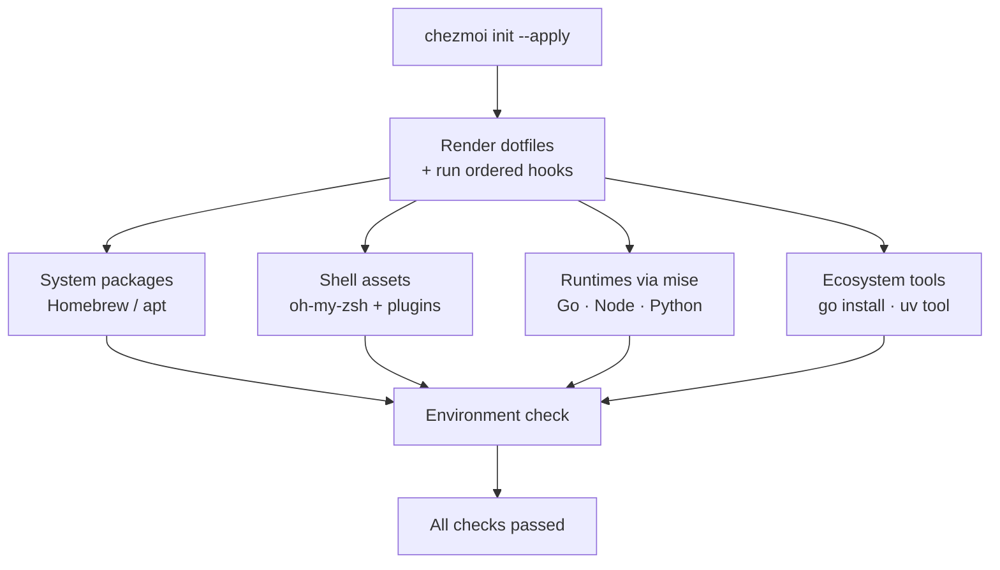

# oh-my-devenv

**English** | [中文](README.zh.md)

> One command takes a clean **macOS**, **Ubuntu / Debian**, or **WSL** machine to a fully configured shell, pinned language runtimes, and a modern CLI toolchain — managed by [chezmoi](https://www.chezmoi.io/).

[](https://github.com/kangmingxuan/oh-my-devenv/actions/workflows/smoke-tests.yml)
[](https://github.com/kangmingxuan/oh-my-devenv/actions/workflows/apply-tests.yml)
[](https://github.com/kangmingxuan/oh-my-devenv/actions/workflows/secret-scan.yml)
[](LICENSE)


oh-my-devenv is a shared, reproducible development-environment baseline. Point `chezmoi` at it on a fresh machine and minutes later you have managed shells, language runtimes, and a curated CLI toolchain — all on `PATH`, all from a single source of truth. Machine- and team-specific tweaks stay in local overlays, so the baseline stays clean and portable.

## What you get

- **Cross-platform from one source** — macOS (Intel + Apple Silicon), Ubuntu / Debian, and WSL share the same templated baseline.
- **One-command bootstrap** — `chezmoi init --apply` installs everything through ordered hooks; re-running is idempotent and safe.
- **Layered and reproducible** — chezmoi orchestrates system packages, shell assets, [mise](https://mise.jdx.dev/) runtimes, and per-language tools, each from its own manifest.
- **Managed shells** — `zsh` with [oh-my-zsh](https://ohmyz.sh/) plugins (autosuggestions, completions, syntax highlighting) plus a matching `bash` setup.
- **Pinned runtimes** — Go, Node, Python, and golangci-lint via mise, plus ecosystem tools such as `gopls`, `dlv`, `ruff`, `basedpyright`, and `pre-commit`.
- **Modern CLI toolkit** — ripgrep, fd, bat, fzf, jq, direnv, tmux, shellcheck, shfmt, and more.
- **Safe first run** — backs up any existing managed dotfiles and prompts once for your Git identity.
- **Local overlays, not forks** — keep machine, team, and secret settings under `~/.config/oh-my-devenv/` and `*.local` files; never edit the shared baseline.
- **Team-ready** — one reproducible baseline the whole team can track, with machine- and team-specific values kept in local overlays.

## How it works



chezmoi is the single entry point: it renders your dotfiles, then runs ordered bootstrap hooks that install each layer and finish with a verification step. See [docs/01-onboarding.md](docs/01-onboarding.md) for the hook-by-hook walkthrough.

## Quick Start

This is the default first-run path for a clean machine. You should be able to finish it without opening another doc.

### 1. Install `git`, `curl`, and `chezmoi`

Use the block for your platform. Do not continue until the last line prints paths for `git`, `curl`, and `chezmoi` in this same shell. Once it does, `chezmoi` is already on `PATH` in the current shell session, so you can run Step 2 immediately below without opening a new terminal.

**macOS**

```bash
if ! command -v brew >/dev/null 2>&1; then
  /bin/bash -c "$(curl -fsSL https://raw.githubusercontent.com/Homebrew/install/HEAD/install.sh)"
fi
if [[ -x /opt/homebrew/bin/brew ]]; then
  eval "$(/opt/homebrew/bin/brew shellenv)"
elif [[ -x /usr/local/bin/brew ]]; then
  eval "$(/usr/local/bin/brew shellenv)"
fi
brew install git curl chezmoi
command -v git curl chezmoi
```

**Ubuntu / Debian / WSL**

```bash
sudo apt-get update
sudo apt-get install -y git curl
sh -c "$(curl -fsLS get.chezmoi.io)" -- -b "$HOME/.local/bin"
export PATH="$HOME/.local/bin:$PATH"
command -v git curl chezmoi
```

### 2. Bootstrap the baseline

Use the repository URL below.

**SSH**

```bash
chezmoi init --apply git@github.com:kangmingxuan/oh-my-devenv.git
```

**HTTPS**

```bash
chezmoi init --apply https://github.com/kangmingxuan/oh-my-devenv.git
```

The first apply backs up any pre-existing managed files, prompts once for your Git author name and email, deploys the dotfiles, runs the ordered bootstrap hooks (packages, shell assets, runtimes, ecosystem tools), and ends with an environment check. On success you will see **`All checks passed.`** and a list of core tool versions.

<details>
<summary><b>macOS:</b> opt in to OrbStack or other optional casks before the first apply</summary>

The default macOS bootstrap installs only the shared baseline. To include local Homebrew apps such as OrbStack during the first apply, declare them first:

```bash
mkdir -p "${XDG_CONFIG_HOME:-$HOME/.config}/oh-my-devenv"
cat > "${XDG_CONFIG_HOME:-$HOME/.config}/oh-my-devenv/Brewfile.local" <<'EOF'
cask "orbstack"
EOF
cat >> "${XDG_CONFIG_HOME:-$HOME/.config}/oh-my-devenv/env.sh" <<'EOF'
export DOTFILES_EXTRA_BREWFILES="${XDG_CONFIG_HOME:-$HOME/.config}/oh-my-devenv/Brewfile.local"
EOF
```

To install this repo's optional catalog instead, set `DOTFILES_INSTALL_REPO_OPTIONAL_BREWFILE=1`. After the first bootstrap, sync local Brewfile changes explicitly with `brew bundle install --file="${XDG_CONFIG_HOME:-$HOME/.config}/oh-my-devenv/Brewfile.local"`.

</details>

### Before you run it

- Already have another dotfiles baseline or a hand-managed shell setup to preserve? Read [disposable-environment reset](docs/03-maintenance.md#disposable-environment-reset) first.
- On a restricted network that needs mirrors or private package wiring? Keep those values in local overlays — start from [docs/local-overlay-examples/README.md](docs/local-overlay-examples/README.md) and see the [restricted-network notes](docs/01-onboarding.md#restricted-network).

### After first install

To pull the latest source changes and reapply them:

```bash
chezmoi update
```

If you are editing the local source checkout directly and only want to re-render the managed files:

```bash
chezmoi apply
```

For prompts, hook order, success signals, and troubleshooting, see [docs/01-onboarding.md](docs/01-onboarding.md).

## Scope and expectations

This repository is maintained on a **best-effort** basis by a single maintainer. Treat it as a shared baseline for laptops, VMs, and disposable notebook environments: it gets a clean machine to a working shell, runtime, and CLI toolchain quickly — it is not a platform-grade product with hard guarantees for every runner or network path. Defaults stay intentionally conservative, and machine- or team-specific settings belong in local overlays, not the shared baseline. On macOS, OrbStack is an optional local add-on, not part of the baseline.

## Documentation

- [docs/01-onboarding.md](docs/01-onboarding.md) — deeper first-run walkthrough: prompts, hook order, success signals, and troubleshooting.
- [docs/local-overlay-examples/README.md](docs/local-overlay-examples/README.md) — copyable templates for machine-only tweaks that do not belong in the shared baseline.
- [docs/README.md](docs/README.md) — the full documentation map.
- [CONTRIBUTING.md](CONTRIBUTING.md) — scope rules and secret hygiene for contributing to the baseline.
- [CHANGELOG.md](CHANGELOG.md) — user-visible changes by milestone.

## License

Released under the [MIT License](LICENSE).
