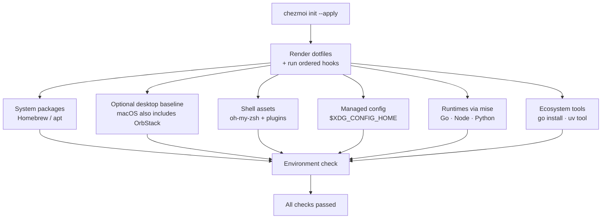

# oh-my-devenv

**English** | [中文](README.zh.md)

> One command takes a clean **macOS**, **Ubuntu / Debian**, or **WSL** machine to a fully configured shell, pinned language runtimes, and a modern CLI toolchain — managed by [chezmoi](https://www.chezmoi.io/).

[](https://github.com/kangmingxuan/oh-my-devenv/actions/workflows/smoke-tests.yml)
[](https://github.com/kangmingxuan/oh-my-devenv/actions/workflows/apply-tests.yml)
[](https://github.com/kangmingxuan/oh-my-devenv/actions/workflows/secret-scan.yml)
[](LICENSE)


oh-my-devenv is an opinionated, reproducible development environment. It publishes one maintainer's current choices as a coherent baseline: use it when those choices fit, and do not use it when they do not. Point `chezmoi` at it on a fresh machine and minutes later you have managed shells, language runtimes, and a curated CLI toolchain — all from a single source of truth. Secrets and private machine facts stay in local overlays so the public baseline remains safe to clone.

## What you get

- **Cross-platform from one source** — macOS (Intel + Apple Silicon), Ubuntu / Debian, and WSL share the same templated baseline.
- **One-command bootstrap** — `chezmoi init --apply` installs everything through ordered hooks; re-running is idempotent and safe.
- **Layered and reproducible** — chezmoi orchestrates system packages, optional desktop assets, shell assets, [mise](https://mise.jdx.dev/) runtimes, and per-language tools, each from its own manifest.
- **Managed shells** — first-class completion for Zsh everywhere and Bash on Linux / WSL, with intentionally limited Bash support on macOS.
- **Pinned runtimes** — Go, Node, Python, and golangci-lint via mise, plus ecosystem tools such as `gopls`, `dlv`, `ruff`, `basedpyright`, and `pre-commit`.
- **Modern CLI toolkit** — ripgrep, fd, bat, fzf, jq, direnv, tmux, shellcheck, shfmt, and more.
- **Opt-in desktop baseline** — one all-or-nothing platform bundle: Ghostty and Maple Mono NF CN on supported workstations, OrbStack on macOS, and the required Linux Fontconfig alias on Ubuntu 26.04+.
- **Safe first run** — backs up any existing managed dotfiles and prompts once for your Git identity and desktop-baseline choice.
- **Local overlays for private facts** — keep credentials, private hosts, and machine-only values in the documented user-owned config slots. The project-owned slots converge under `$XDG_CONFIG_HOME/oh-my-devenv/`, whose default root is `~/.config`.
- **Opinionated by design** — the repository carries one current design, not compatibility profiles or neutral-by-committee defaults.

## How it works


```mermaid
flowchart TD
    A["chezmoi init --apply"] --> B["Render dotfiles<br/>+ run ordered hooks"]
    B --> C["System packages<br/>Homebrew / apt"]
    B --> D["Optional desktop baseline<br/>macOS also includes OrbStack"]
    B --> E["Shell assets<br/>oh-my-zsh + plugins"]
    B --> X["Managed config<br/>$XDG_CONFIG_HOME"]
    B --> F["Runtimes via mise<br/>Go · Node · Python"]
    B --> G["Ecosystem tools<br/>go install · uv tool"]
    C --> H["Environment check"]
    D --> H
    E --> H
    X --> H
    F --> H
    G --> H
    H --> I["All checks passed"]
```

chezmoi is the single entry point: it renders your dotfiles, then runs ordered bootstrap hooks that install each layer and finish with a verification step. See [docs/01-onboarding.md](docs/01-onboarding.md) for the hook-by-hook walkthrough.

## Quick Start

This is the default first-run path for a clean machine. You should be able to finish it without opening another doc.

### 1. Install `git`, `curl`, and `chezmoi`

Use the block for your platform. Do not continue until the last line prints paths for `git`, `curl`, and `chezmoi` in this same shell. Once it does, `chezmoi` is already on `PATH` in the current shell session, so you can run Step 2 immediately below without opening a new terminal.

**macOS**

```bash
if ! command -v brew >/dev/null 2>&1; then
  /bin/bash -c "$(curl -fsSL https://raw.githubusercontent.com/Homebrew/install/HEAD/install.sh)"
fi
if [[ -x /opt/homebrew/bin/brew ]]; then
  eval "$(/opt/homebrew/bin/brew shellenv)"
elif [[ -x /usr/local/bin/brew ]]; then
  eval "$(/usr/local/bin/brew shellenv)"
fi
brew install git curl chezmoi
command -v git curl chezmoi
```

**Ubuntu / Debian / WSL**

```bash
sudo apt-get update
sudo apt-get install -y git curl
sh -c "$(curl -fsLS get.chezmoi.io)" -- -b "$HOME/.local/bin"
export PATH="$HOME/.local/bin:$PATH"
command -v git curl chezmoi
```

### 2. Bootstrap the baseline

Use the repository URL below.

The baseline honors `XDG_CONFIG_HOME` for managed mise, Ghostty, and Fontconfig
files plus the `oh-my-devenv`, mise, and Ghostty overlays. It defaults to
`$HOME/.config`. To use a different config root, export an absolute path before
running `chezmoi`; local env files must not set or change it:

```bash
export XDG_CONFIG_HOME="$HOME/.config-work"
```

**SSH**

```bash
chezmoi init --apply git@github.com:kangmingxuan/oh-my-devenv.git
```

**HTTPS**

```bash
chezmoi init --apply https://github.com/kangmingxuan/oh-my-devenv.git
```

The first apply backs up any pre-existing managed files, prompts once for your Git author name, email, and desktop-baseline choice, deploys the dotfiles, runs the ordered bootstrap hooks, and ends with an environment check. The desktop choice defaults to yes on macOS and graphical Ubuntu 26.04+ hosts, and to no on non-graphical or unsupported Linux hosts and WSL; the repository's apply-CI fixture disables it explicitly. On macOS, accepting the choice installs Ghostty, Maple Mono NF CN, and OrbStack together. Homebrew installs the OrbStack application, but you must launch it once to finish setup; using OrbStack for freelance, business, or professional work requires a paid [OrbStack license](https://docs.orbstack.dev/licensing). On success you will see **`All checks passed.`** and a list of core tool versions.

### Before you run it

- Already have another dotfiles baseline or a hand-managed shell setup to preserve? Read [disposable-environment reset](docs/03-maintenance.md#disposable-environment-reset) first.
- On a restricted network that needs mirrors or private package wiring? Keep those values in local overlays — start from [docs/local-overlay-examples/README.md](docs/local-overlay-examples/README.md) and see the [restricted-network notes](docs/01-onboarding.md#restricted-network).

### After first install

To pull the latest source changes and reapply them:

```bash
chezmoi update
```

If you are editing the local source checkout directly and only want to re-render the managed files:

```bash
chezmoi apply
```

For prompts, hook order, success signals, and troubleshooting, see [docs/01-onboarding.md](docs/01-onboarding.md).

## Scope and expectations

This repository is maintained on a **best-effort** basis by a single maintainer. Treat it as that maintainer's public, opinionated baseline for laptops, VMs, and disposable notebook environments: it gets a clean machine to a working shell, runtime, and CLI toolchain quickly, but it is not a platform-grade product or a promise to fit every workflow. Public defaults are deliberate; credentials, private infrastructure, and machine-only facts belong in local overlays. The desktop baseline is an explicit, all-or-nothing machine choice and currently installs only on macOS and non-WSL Ubuntu 26.04+; its contents are platform-specific, with OrbStack included on macOS.

## Documentation

- [docs/01-onboarding.md](docs/01-onboarding.md) — deeper first-run walkthrough: prompts, hook order, success signals, and troubleshooting.
- [docs/local-overlay-examples/README.md](docs/local-overlay-examples/README.md) — copyable templates for private and machine-only facts that must not enter the public baseline.
- [docs/README.md](docs/README.md) — the full documentation map.
- [CONTRIBUTING.md](CONTRIBUTING.md) — scope rules and secret hygiene for contributing to the baseline.
- [CHANGELOG.md](CHANGELOG.md) — user-visible changes by milestone.

## License

Released under the [MIT License](LICENSE).
