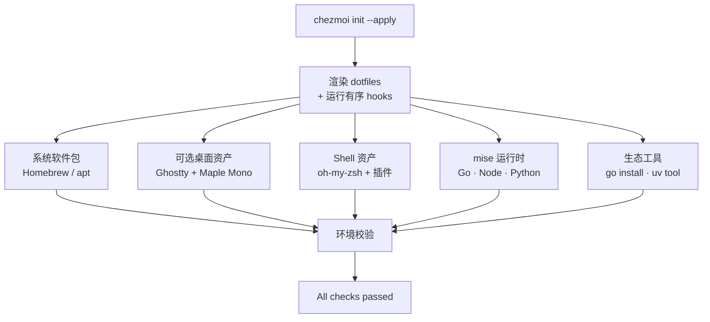

# oh-my-devenv

[English](README.md) | **中文**

> 一条命令，把全新的 **macOS**、**Ubuntu / Debian** 或 **WSL** 机器，变成配置完善的 shell、锁定版本的语言运行时和现代 CLI 工具链 —— 由 [chezmoi](https://www.chezmoi.io/) 统一管理。

[](https://github.com/kangmingxuan/oh-my-devenv/actions/workflows/smoke-tests.yml)
[](https://github.com/kangmingxuan/oh-my-devenv/actions/workflows/apply-tests.yml)
[](https://github.com/kangmingxuan/oh-my-devenv/actions/workflows/secret-scan.yml)
[](LICENSE)


oh-my-devenv 是一套可共享、可复现的开发环境基线。在一台全新机器上让 `chezmoi` 指向它，几分钟后你就拥有受管的 shell、语言运行时和精选 CLI 工具链 —— 全部进入 `PATH`，全部来自同一份事实来源。受支持的工作站还可选择启用共享 Ghostty 桌面基线。机器和团队的个性化设置留在本地 overlay 中，基线本身保持干净、可移植。

## 功能亮点

- **一份来源，跨平台通用** —— macOS（Intel + Apple Silicon）、Ubuntu / Debian 与 WSL 共用同一套模板化基线。
- **一条命令完成引导** —— `chezmoi init --apply` 通过有序 hook 安装全部内容；重复运行幂等且安全。
- **分层且可复现** —— chezmoi 统一编排系统软件包、可选桌面资产、shell 资产、[mise](https://mise.jdx.dev/) 运行时与各语言工具，每一层都有自己的清单（manifest）。
- **受管的 shell** —— `zsh` 搭配 [oh-my-zsh](https://ohmyz.sh/) 插件（autosuggestions、completions、syntax highlighting），并配套 `bash` 配置。
- **锁定版本的运行时** —— 通过 mise 管理 Go、Node、Python 与 golangci-lint，外加 `gopls`、`dlv`、`ruff`、`basedpyright`、`pre-commit` 等生态工具。
- **现代 CLI 工具箱** —— ripgrep、fd、bat、fzf、jq、direnv、tmux、shellcheck、shfmt 等。
- **可选桌面基线** —— 在 macOS 与 Ubuntu 26.04+ 桌面机器上安装 Ghostty、Maple Mono NF CN 及配套受管配置，包括 Linux 所需的 Fontconfig 别名规则。
- **安全的首次运行** —— 自动备份已存在的受管 dotfiles，并仅在首次询问 Git 身份和桌面基线选择。
- **用本地 overlay，而非分叉** —— 把机器、团队与密钥设置放在 `~/.config/oh-my-devenv/` 和 `*.local` 文件中，绝不修改共享基线。
- **面向团队** —— 整个团队可追踪同一套可复现基线，机器与团队特定的值都放在本地 overlay 中。

## 工作原理



chezmoi 是唯一入口：它先渲染你的 dotfiles，再运行有序的引导 hook，逐层安装并以一次校验步骤收尾。逐个 hook 的详细说明见 [docs/01-onboarding.md](docs/01-onboarding.md)。

## 快速开始

这是全新机器的默认首次运行路径。你应当无需打开其他文档即可完成。

### 1. 安装 `git`、`curl` 和 `chezmoi`

运行与你平台对应的代码块。在最后一行打印出 `git`、`curl`、`chezmoi` 三者的路径之前，请勿继续。一旦打印成功，`chezmoi` 就已在当前 shell 会话的 `PATH` 中，你可以直接进行下面的步骤 2，无需打开新终端。

**macOS**

```bash
if ! command -v brew >/dev/null 2>&1; then
  /bin/bash -c "$(curl -fsSL https://raw.githubusercontent.com/Homebrew/install/HEAD/install.sh)"
fi
if [[ -x /opt/homebrew/bin/brew ]]; then
  eval "$(/opt/homebrew/bin/brew shellenv)"
elif [[ -x /usr/local/bin/brew ]]; then
  eval "$(/usr/local/bin/brew shellenv)"
fi
brew install git curl chezmoi
command -v git curl chezmoi
```

**Ubuntu / Debian / WSL**

```bash
sudo apt-get update
sudo apt-get install -y git curl
sh -c "$(curl -fsLS get.chezmoi.io)" -- -b "$HOME/.local/bin"
export PATH="$HOME/.local/bin:$PATH"
command -v git curl chezmoi
```

### 2. 引导安装基线

使用下面的仓库 URL。

**SSH**

```bash
chezmoi init --apply git@github.com:kangmingxuan/oh-my-devenv.git
```

**HTTPS**

```bash
chezmoi init --apply https://github.com/kangmingxuan/oh-my-devenv.git
```

首次 apply 会：备份任何已存在的受管文件，仅询问一次 Git 作者名、邮箱与桌面基线选择，部署 dotfiles，运行有序引导 hook，并以环境校验收尾。macOS 与带图形会话的 Ubuntu 26.04+ 默认启用桌面基线；无图形会话或不受支持的 Linux 与 WSL 默认关闭；本仓库的 apply CI fixture 会显式关闭。成功时你会看到 **`All checks passed.`** 以及一份核心工具版本列表。

<details>
<summary><b>macOS：</b>在首次 apply 之前选装 OrbStack 等可选 cask</summary>

macOS 默认引导只安装共享基线。若想在首次 apply 时一并安装 OrbStack 等本地 Homebrew 应用，请先声明它们：

```bash
mkdir -p "${XDG_CONFIG_HOME:-$HOME/.config}/oh-my-devenv"
cat > "${XDG_CONFIG_HOME:-$HOME/.config}/oh-my-devenv/Brewfile.local" <<'EOF'
cask "orbstack"
EOF
cat >> "${XDG_CONFIG_HOME:-$HOME/.config}/oh-my-devenv/env.sh" <<'EOF'
export DOTFILES_EXTRA_BREWFILES="${XDG_CONFIG_HOME:-$HOME/.config}/oh-my-devenv/Brewfile.local"
EOF
```

若想改为安装本仓库的可选清单，设置 `DOTFILES_INSTALL_REPO_OPTIONAL_BREWFILE=1`。首次引导之后，本地 Brewfile 的变更需用 `brew bundle install --file="${XDG_CONFIG_HOME:-$HOME/.config}/oh-my-devenv/Brewfile.local"` 显式同步。

</details>

### 运行前须知

- 这台机器已有另一套 dotfiles 基线，或有想保留的手工 shell 配置？请先阅读[一次性环境重置](docs/03-maintenance.md#disposable-environment-reset)。
- 处于需要镜像或私有包接入的受限网络？把这些值放进本地 overlay —— 从 [docs/local-overlay-examples/README.md](docs/local-overlay-examples/README.md) 开始，并参阅[受限网络说明](docs/01-onboarding.md#restricted-network)。

### 首次安装之后

拉取最新源改动并重新应用：

```bash
chezmoi update
```

如果你直接编辑本地源检出，只想重新渲染受管文件：

```bash
chezmoi apply
```

关于提示、hook 顺序、成功信号与故障排查，见 [docs/01-onboarding.md](docs/01-onboarding.md)。

## 适用范围与预期

本仓库由单人以 **尽力而为（best-effort）** 的方式维护。请把它当作面向笔记本、虚拟机和一次性实验环境的共享基线：它能快速把全新机器带到可用的 shell、运行时与 CLI 工具链状态 —— 但它不是对每个运行环境或网络路径都提供硬性保证的平台级产品。默认值刻意保持保守，机器或团队特定的设置应放在本地 overlay 中，而非共享基线。桌面基线是显式的机器选择，目前仅在 macOS 和非 WSL 的 Ubuntu 26.04+ 上安装；OrbStack 仍是独立的本机可选附加项。

## 文档

- [docs/01-onboarding.md](docs/01-onboarding.md) —— 更深入的首次运行讲解：提示、hook 顺序、成功信号与故障排查。
- [docs/local-overlay-examples/README.md](docs/local-overlay-examples/README.md) —— 不属于共享基线的本机专属调整的可复制模板。
- [docs/README.md](docs/README.md) —— 完整文档导航。
- [CONTRIBUTING.md](CONTRIBUTING.md) —— 为基线贡献时的范围规则与密钥卫生。
- [CHANGELOG.md](CHANGELOG.md) —— 按里程碑列出的用户可见变更。

## 许可证

基于 [MIT 许可证](LICENSE)发布。
